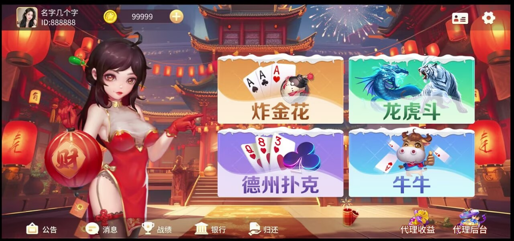
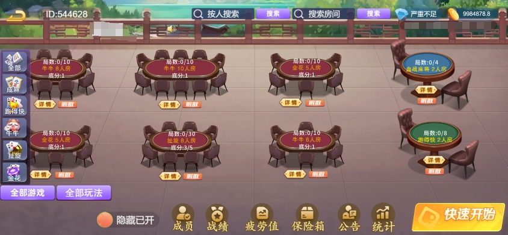
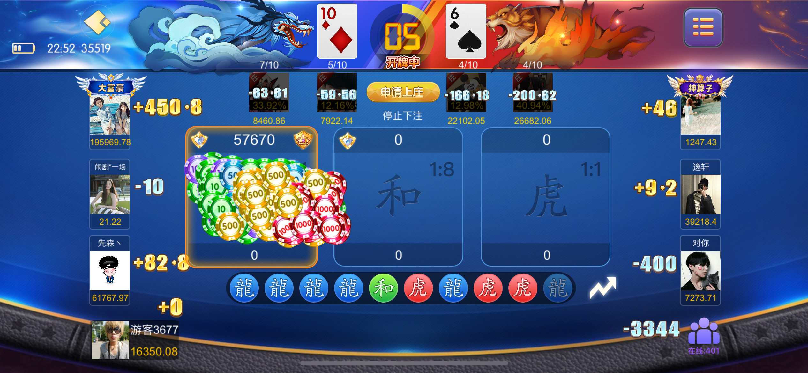

# JAVAQP

后端 **Java**，前端 **Cocos Creator** 的棋牌游戏。

> 非网上随意开源的源码拼凑，是经历过实战的运营级产品。

---

## 框架

Cocos 客户端 + Java 游戏服 + Redis + MySQL。

亲友圈、大厅共用一套玩法，只是进桌方式不同。支持 **Android / iOS / H5** 打包。

## 两种模式

 

**亲友圈（大联盟）**  
可创建亲友圈、创建好友房，传统大联盟模式。

**大厅**  
无需加入亲友圈，绑定上级即可进入，抽成比例固定。

## 现成玩法

规则、人数、底分后台可配，也可按需求新做。

| 类型 | 玩法 |
| --- | --- |
| 麻将 | 血战到底、红中麻将、简阳麻将、幺鸡麻将（四川玩法为主） |
| 扑克 | 炸金花、跑得快、抢庄牛牛、扯旋、德州扑克 |
| 百人场 | 龙虎斗 |
| 字牌 | 贰柒拾、秀山黄十八、秀山博胡 |

## 联系

**不免费。** 有实力可谈联合运营。

Telegram：[redguysss](https://t.me/redguysss)
